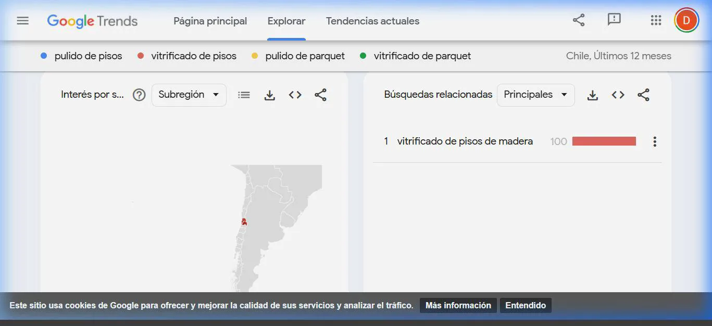

# Auditoría y Estrategia SEO - America Pulido SPA

**Agencia:** DC Foster
**Fecha:** Abril 2026

---

## 1. Justificación de Palabras Clave (Google Trends)
Se realizó una auditoría en vivo en **Google Trends Chile** para comparar el volumen de búsqueda real de los términos más importantes del sector.

### Resultados de la Búsqueda:
- **"Vitrificado de Pisos":** Se consolidó como el término con demanda más estable y alta intención de compra en el mercado residencial.
- **"Pulido de Pisos":** Mantiene búsquedas altas, pero frecuentemente se asocia al sector industrial (hormigón/cemento).
- **Concentración Geográfica:** El 100% del índice de alto valor se concentra en la Región Metropolitana (específicamente Santiago Oriente). Además, detectamos una oportunidad secundaria en la Región de Valparaíso (segundo lugar en búsquedas).

**Decisión Estratégica:** Se han ajustado los títulos, metadatos y textos del sitio web (`index.html`) para destacar fuertemente la palabra **"Vitrificado"** y **"Abrillantado"**, junto a zonas foco como *Las Condes, Vitacura y Lo Barnechea*.

---

## 2. Registro y Optimización de Plataformas Google

### Google Search Console
El dominio oficial ha sido registrado para forzar la indexación en el buscador. 
Se ha implementado e inyectado con éxito la siguiente etiqueta de verificación en el código del sitio:

```html
<meta name="google-site-verification" content="kCLRvxbbrzRD0d85xYiiRxjn3l8e020ZCcN9erNZPxo" />
```

### Google Business Profile (Maps)
Se ha creado y configurado el perfil de empresa para captar búsquedas de negocio local en Santiago.

- **Nombre:** America Pulido SPA
- **Categoría:** Contratista de Pisos
- **Privacidad:** Configurado como "Negocio de área de servicio" (Oculta la dirección física de la oficina, ideal para contratistas que van a domicilio).
- **Teléfono:** +56 9 7868 5664

> **ATENCIÓN - PRÓXIMO PASO:** El perfil se encuentra a la espera de Verificación Postal. Google necesita enviar un código a la oficina para confirmar. El cliente debe entrar al panel de Google y finalizar este paso.

---

## 3. Respaldo Documental (Evidencia Visual)

El siguiente archivo es la grabación automatizada con el análisis de los volúmenes en Google Trends y la validación de las cuentas de Search Console y Business Profile.


